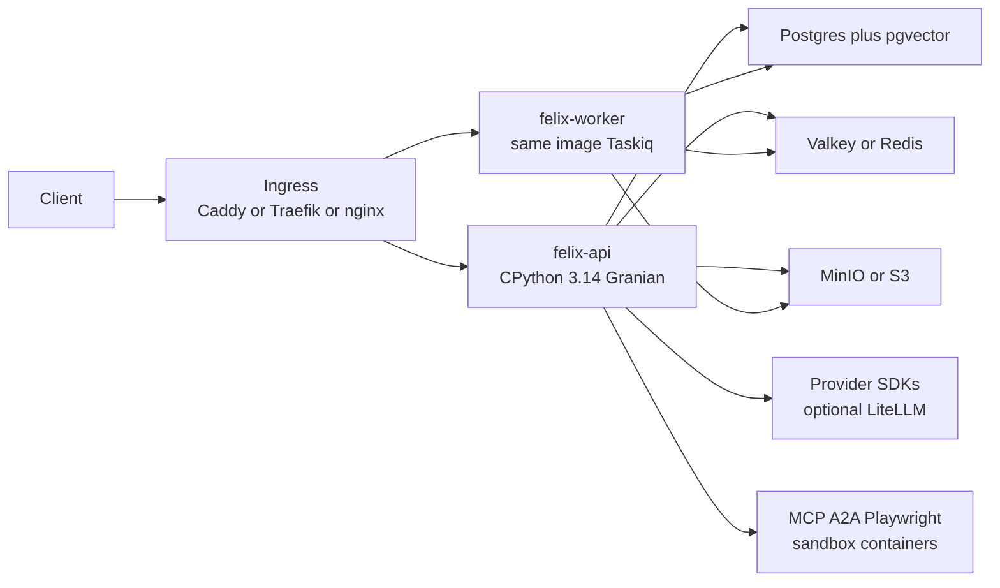

# Felix: enterprise Python harness

Greenfield project at [`/Users/blake/Projects/felix`](/Users/blake/Projects/felix) (empty folder, no git). Product name is **Felix**. Do **not** clone `blakebauman/felix` or memoturn into this workspace. Two references:

- **Behavior / protocols:** TypeScript Felix at [`/Users/blake/Sites/cloudflare/orchestrator`](/Users/blake/Sites/cloudflare/orchestrator) — manifests, three seams, governance, `/v1` `/chat` `/a2a` `/mcp`.
- **Self-host Python DX / durable runtime:** Memoturn at [`/Users/blake/Sites/projects/memoturn.ai`](/Users/blake/Sites/projects/memoturn.ai) — uv, Compose, Helm, sandbox ladder, fibers, plugin seam.

Commerce is out of v1; the plugin seam stays so a later `packages/commerce` plugin can land.

## Audit (TypeScript Felix)

TypeScript-only monorepo (~195 harness/commerce/api modules, ~158 vitest files). There is no Python orchestrator; the only Python is `examples/python-sandbox/runtime/evaluator.py`. Felix is a **custom harness on Workers primitives**, not `@cloudflare/agents`. Extra contributor notes live in [`CLAUDE.md`](/Users/blake/Sites/cloudflare/orchestrator/CLAUDE.md).

Felix is a managed-agents harness on Cloudflare Workers (Hono + Durable Objects + Neon/Hyperdrive + R2/KV/Queues/Workflows). An `apiVersion: orchestrator/v1` YAML compiles into an agent with `/v1/*`, `/chat`, `/a2a`, `/mcp`, plus management surfaces (`/audit`, `/plans`, `/jobs`, `/approvals`, `/manifests`, `/eval`).

Three seams (must preserve):

- **Session** — append-only event log + strategies (`full_replay` / `windowed:N` / `summarizing:N` / `semantic:N`)
- Pattern / model registries — `react`, `deep`, `router`, `parallel`, `groupchat`, `reflect`, `plan_execute` + Anthropic / OpenAI / Workers AI (Python Felix drops Workers AI; uses Ollama + LiteLLM instead)
- **ToolExecutor** — transports `local` / `mcp` / `a2a` / `container` / `queue` / `sandbox` / `browser`; governance wrappers keep the inner transport label

Enterprise already present: tenant-prefixed composite keys, JWT (Access + Cognito + self-issued JWKS), 8-layer governance, canary manifests + auto-rollback, eval CI gate, durable Workflows, Ed25519 federation bundles, AES-GCM OAuth cache.

Gaps the Python version should close (TS follow-ups plus documented partials):

- Real OpenTelemetry export (TS still Analytics Engine + OTel-shaped spans)
- Audit warehouse (Pipelines → R2 Parquet)
- Regex PII vs a real NER/PII stack
- Isolate CPU/time ceilings that force adapter Workers for sandbox/browser
- Queue-transport write-backs are **not** content-screened at `POST /internal/sessions/:id/events`
- Bedrock guardrail provider is a placeholder in the TS guardrails config
- Semantic session strategy has no embedding-result cache (degrades on BGE failure)

Do **not** run the product on Cloudflare compute: no Workers, Python Workers, Containers, Durable Objects, Hyperdrive, KV, Queues, Workflows, AI Gateway, Workers AI, Pages Functions, or wrangler deploys. The TypeScript repo is a behavior reference only.

Cloudflare **as a front door is fine**: DNS, CDN, TLS, and WAF in front of your origin (Caddy/Traefik/nginx or the API boxes). The origin is still CPython you operate. Object storage stays MinIO or S3 you control — not R2 as a Worker binding. Embeddings and OSS models are Ollama / LiteLLM / provider APIs.

## Recommended architecture



- **`apps/api`** — CPython FastAPI on Granian. All HTTP: `/chat`, `/v1`, `/a2a`, `/mcp`, management APIs, OpenAPI.
- **`apps/worker`** — same image, Taskiq (or ARQ) consumer: audit drain, scheduled jobs, memory consolidation, anomaly/continuous-eval, durable-run resume. Replaces Workers Cron + Queues + Workflows.
- **`packages/harness`** — library: manifests, seams, patterns, tools, auth, plugins. Tests do not need Docker except integration.
- **`packages/cli`** — Typer: `felix migrate`, `felix eval`, `felix mint-jwt`, `felix bundle-manifests`.
- **`deploy/`** — `docker-compose.yml` (dev + prod overlay) and Kubernetes manifests (Deployment, Service, Ingress, Cron-equivalent via the worker, PVC/external Postgres).

TS Felix platform → owned infra:

- HTTP Worker → Granian behind your ingress
- Durable Objects → **Postgres single-writer actors** (not Cloudflare DOs; see below)
- Hyperdrive / Neon → Postgres you run
- KV → Valkey
- R2 → MinIO (or S3-compatible storage you operate — not Cloudflare R2)
- Queues → Valkey streams or Postgres-backed Taskiq
- Workflows (`execution.mode: durable`) → Durability Protocol (Postgres fibers; Temporal optional)
- AI Gateway / Workers AI → Anthropic/OpenAI SDKs, Ollama, optional self-hosted LiteLLM
- Analytics Engine → OpenTelemetry + Prometheus

## Durable execution: actors vs Temporal vs Cloudflare DOs

Do **not** use Cloudflare Durable Objects. They only exist on Workers and would undo the self-hosted decision.

Split the two jobs DOs were doing in TS Felix:

- **Single-writer entity** (ConversationDO, ApprovalsDO, A2ATaskDO) — this is an *actor*, not a workflow. Implement with a mailbox + Postgres row lock / advisory lock per `(tenant, entity_id)`, same idea as Memoturn's in-process actor. Session appends, approval `decide`, and A2A task state serialize here. Hibernation evicts the in-memory actor; Postgres is source of truth.
- **Crash-safe multi-step work** (AgentWorkflow) — this is *durable execution*. Hide it behind Memoturn's `Durability` Protocol so backends can swap.

**Default durability backend: Postgres fibers** (`step` / `stash` / `sleep`, scheduler in `apps/worker`). Same database you already run. Enough for agent turns, HITL pause/resume, and cron jobs. No extra cluster for v1.

**Temporal: optional Durability backend, not a second system.** Add `FELIX_DURABILITY=temporal` when you want Temporal's timers, signals, and ops UI for long sagas (days-long approvals, fan-out across services). Run Temporal yourself (Compose/Helm) or Temporal Cloud. Rules:

- One `Durability` interface; a run uses fibers **or** Temporal, never both
- Do not put session event logs or approval locks into Temporal — those stay actors
- Do not put every tool call in a Temporal workflow — only `spec.execution.mode: durable` and named fibers
- Extra `temporalio` optional dependency; Compose profile `temporal` for local Temporal + UI

v1 does not require a Temporal cluster. The Protocol and `execution.mode: durable` land in Phase 4 so a Temporal backend can plug in later without rewriting patterns.

Local: `docker compose up` starts Postgres+pgvector, Valkey, MinIO, api, worker. Production: same images on your cluster; secrets via env/files. Helm chart shape copied from Memoturn (`deploy/helm` assumes external Postgres/Valkey/object storage).

## Port from Memoturn

Memoturn ([`/Users/blake/Sites/projects/memoturn.ai`](/Users/blake/Sites/projects/memoturn.ai)) is already the self-host Python runtime this plan wants. **Do not fork it.** Felix keeps the TypeScript product identity (manifests, governance, OpenAI-compat). Steal Memoturn's DX and the runtime capabilities TS Felix never had.

**DX — copy the shape (Phase 0)**

- `uv` workspace + hatchling, `[project.optional-dependencies]` extras (`sandbox`, `browser`, `mcp`, `a2a`, `otel`, `embeddings`, `oidc`, later `temporal`) so core stays thin. Postgres/Valkey/S3 are the default self-host profile, not optional in prod.
- `Makefile`: `install`, `check` (lint + format-check + type + test), `dev`, `dev-ollama`, `up`/`down`, `cli`, `seed`, `dev-auth`
- pydantic-settings with `FELIX_` prefix; `.env.example` requiring `openssl rand -hex 32` for Postgres/MinIO passwords
- Compose topology: control-plane + **pgvector** + **Valkey** (not Redis 7.4+) + MinIO + optional OTel collector. Fail-fast `validate_runtime()` if scale-out is on without Postgres/S3
- Helm: HPA, PDB, NetworkPolicy, sandbox RBAC, ingress — start from [`deploy/helm/memoturn`](/Users/blake/Sites/projects/memoturn.ai/deploy/helm/memoturn)
- CI: `astral-sh/setup-uv`, path filters, ruff + ty + pytest, bandit, Trivy/SBOM on image. pytest `asyncio_mode = auto`, 120s timeout, fakeredis, skipif for optional extras
- Auth modes for DX: `none` (localhost only) / `api_key` / `jwt` — Memoturn's `make dev-auth` + seeded keys. TS Felix JWT remains the production default
- Offline path: Ollama extra like `make dev-ollama`

**Architecture — adopt as Protocols beside the three Felix seams**

- `Provider`, `Sandbox`, `Durability` Protocols ([`providers/base.py`](/Users/blake/Sites/projects/memoturn.ai/src/memoturn/providers/base.py), [`sandbox/base.py`](/Users/blake/Sites/projects/memoturn.ai/src/memoturn/sandbox/base.py)). Felix already has model registry + tool transports; these are the **backend** interfaces under them
- Plugin registry that core never imports optional packages ([`plugins.py`](/Users/blake/Sites/projects/memoturn.ai/src/memoturn/plugins.py)): authenticators, extra routers, audit/usage sinks, tenant limits. Same rule as TS `installedPlugins()`, plus Memoturn's load-if-installed enterprise discovery
- Execution ladder (Tier 0 workspace → 1 sandboxed Python → 2 `uv` deps → 3 Playwright → 4 shell). Maps onto Felix transports `local` / `sandbox` / `container` / `browser` with **capability RPC, zero ambient authority** instead of the TS adapter Workers
- Fibers (`step` / `stash` / `sleep`) as the **default** `Durability` implementation for `spec.execution.mode: durable` — Postgres-backed. Temporal is a later backend on the same Protocol, not v1 infra.
- Scale-out later: consistent-hash ownership + Postgres leases + owner-proxy. Not Phase 0; design actor keys so it can land
- Secrets backends: env / file / Vault (Memoturn M7)
- Workspace VFS (SQLite-or-Postgres metadata + S3 blobs) as a first-class artifact store — stronger than TS R2 spill stubs
- Usage meters emitted by core (tokens, turns, compute-seconds, storage) even if billing is a later plugin

**Features TS Felix does not have — port into Felix**

- Agent hibernation (evict idle compiled agents; rehydrate from Postgres)
- Conversation forking / agent branch-rewind; as-of-turn memory (`origin_seq` / `superseded_seq` on `memory_vectors`)
- Hybrid recall: FTS + topic-key + vector + HyDE, fused with **RRF** (algorithms from Memoturn `memory/long_term.py`; Postgres storage, not SQLite)
- Context blocks (`set_context`) as always-in-prompt working memory alongside SessionStrategy
- Non-destructive compaction that extracts memories before dropping old turns
- Shared memory profiles (cross-agent pools, tenant-scoped)
- Agent-authored revocable extensions (`create_extension`), gated by Felix governance
- Sub-agent child isolation with namespaced storage (`call_subagent`)
- Capability-bridge sandbox (zero ambient authority, Unix/TCP RPC) + warm pool; K8s gVisor extra
- Workspace VFS (metadata in Postgres + blobs in MinIO)
- EventHub: journaled WS/SSE resume via `last_event_id`
- Operator webhooks with HMAC + DLQ replay (distinct from audit batching)
- Durable HITL interrupts that merge with Felix `/approvals` (one store, not two)
- Kubernetes gVisor sandbox backend (optional extra)
- Minimal baked `/ui` chat + optional console SPA later — not Phase 0
- WebSocket CLI (`clients/cli.py` shape) for `make cli`

**Do not port**

- Per-agent SQLite as the system of record (Felix stays tenant-keyed Postgres). SQLite at most as a local actor cache, not default.
- In-process actor-as-the-product (Felix compiles **manifests**; actors cache `build_agent`)
- Memoturn's parallel governance middleware (PII/limits/HITL) — Felix's eight wrappers stay the only pipeline
- Memoturn MCP 1.x / A2A gateways / httpx 1.x / mypy — Felix already owns those protocols; use mcp 2.0, httpx2, ty
- Marketing site (`web/apps/web`), Wrangler/CF web deploy, BSL `enterprise/` billing/SCIM in v1
- Anthropic-only default loop — keep Felix model registry + fallbacks
- Copy-pasting Memoturn modules wholesale; reimplement against Felix types. BSL enterprise code is off-limits.

**License:** Felix stays MIT like TS. Memoturn is Apache-2.0 (core) — patterns and DX are fine to reimplement; do not vendor Memoturn source.

## Latest toolchain (floors as of 2026-08-22)

At scaffold, **do not copy these as upper pins**. Use `uv add` / `uv add --dev` so `uv.lock` records whatever is newest that day. These are the verified floors:

**Runtimes**

- CPython **3.14** (`requires-python = ">=3.14"`) — latest patch is 3.14.7
- Docker image: official `python:3.14-slim` (multi-stage `uv` build)
- Postgres: latest `pgvector/pgvector` tag
- Valkey or Redis latest alpine
- MinIO latest
- No Node, wrangler, workers-py, or Cloudflare Workers SDKs in the product

**Workspace / quality**

- [uv](https://docs.astral.sh/uv/) workspace + lockfile, hatchling, **optional extras** (memoturn-style)
- Makefile `check` as the local CI gate
- ruff **0.16.4+** (lint + format)
- ty **0.0.73+** (typecheck; not memoturn's mypy)
- pytest **9.1.1+**, pytest-asyncio, pytest-timeout, fakeredis, testcontainers
- pre-commit with ruff + ty; CI bandit + Trivy like Memoturn

**API / data**

- FastAPI **0.141.1+** (`fastapi[standard]`)
- Pydantic **2.13.4+**, pydantic-settings
- SQLAlchemy **2.0.52+** async + **psycopg 3** (`psycopg[binary,pool]`) — prefer psycopg over asyncpg
- Alembic async
- pgvector Python bindings
- Granian **2.8.1+** (prod ASGI); FastAPI CLI/uvicorn for `fastapi dev`
- httpx2 **2.12.0+** for all outbound HTTP (openai 3.x and anthropic 1.x already default to it)
- joserfc / cryptography, structlog, prometheus-client, OpenTelemetry SDK + OTLP
- Taskiq (Redis or Postgres broker) for jobs/queues; boto3/aiobotocore for S3; redis.asyncio for cache/rate-limit
- Optional LiteLLM / Ollama as the model gateway you run

**Agents / protocols (Python-native upgrades)**

- openai **3.3.1+**, anthropic **1.0.0+**
- mcp **2.0.0+** (2026-07-28 spec) for `/mcp` server and remote MCP client
- pydantic-ai **2.23.0+** as an **optional** registered pattern (`pattern: pydantic_ai`), not a replacement for the three seams
- microsoft-presidio-analyzer / anonymizer for PII (replaces regex-only guardrails)
- playwright for `transport: browser`
- duckdb + polars for audit warehouse / eval analytics
- bashlex (or tree-sitter) for command-screening AST instead of the TS string projection

**Cloudflare**

- Allowed: DNS, CDN, TLS, WAF in front of the origin you run.
- Not allowed: Workers (including Python Workers), Containers, Durable Objects, Hyperdrive, KV, Queues, Workflows, AI Gateway, Workers AI, Pages Functions, wrangler, Cloudflare SDKs in the app.

## Port map (keep protocol, upgrade internals)

Compatible with TS:

- Manifest `apiVersion: orchestrator/v1` / `kind: Agent` — Pydantic `extra='forbid'` instead of Zod `.strict()`
- Route and JWT scope names (`audit:read`, `manifests:write`, …)
- Tenant thread ids `${tenantId}:${suffix}`, composite `(tenant_id, id)` keys
- Seven built-in patterns + seven transports + eight governance wrappers (`denyOutput` / unforgeable deny marker)
- Bundled non-commerce manifests (`quick`, `deep`, `router`, `oss-*`, `hybrid-router`, `support`, `chat-ui-demo`, `homepage`, `creative`)

Python-only upgrades vs TS:

- OpenTelemetry traces/metrics/logs from day one (closes TS follow-up)
- Presidio PII + a self-hosted or API classifier for content screening
- DuckDB/Polars compaction of `audit_events` → Parquet on object storage
- `pattern: pydantic_ai` and MCP SDK v2 instead of hand-rolled JSON-RPC
- Playwright-native browser transport
- Content-screen queue write-backs at the session landing endpoint (closes a documented TS hole)
- Optional Bedrock/AWS guardrail provider in the judges registry (TS placeholder)
- Cached semantic-strategy embeddings so embedding blips do not drop to full replay
- Hybrid memory recall (RRF + HyDE + FTS + turn-versioning) and context blocks
- EventHub stream resume, operator webhooks+DLQ, capability-bridge sandbox
- Plugin Protocol mirroring [`packages/harness/src/plugins/types.ts`](/Users/blake/Sites/cloudflare/orchestrator/packages/harness/src/plugins/types.ts) plus Memoturn `PluginRegistry` discovery. Core never names a plugin. Enforced by a plugin-boundary test.

## Manifest format

**Yes — YAML (+ JSON) is still the 2026 best practice for GitOps agent config.** There is no single IETF “agent YAML standard.” What *is* current:

- **Anthropic Managed Agents (2026):** version-controlled YAML applied via CLI; sessions reference `agent_id` + version. Control plane ≠ data plane.
- **Pydantic AI AgentSpec:** YAML or JSON files + generated JSON Schema for editor autocomplete (YAML language server).
- **A2A v1.0 Agent Card:** **JSON** at `/.well-known/agent-card.json` — discovery/interop, not the full runtime spec.
- **MCP / SKILL.md:** tools and skills, not the whole agent.

Felix’s `apiVersion: orchestrator/v1` / `kind: Agent` is the Kubernetes-style CRD pattern (GitOps, schema evolution). Keep it. Do not invent a new format.

Three representations, one Pydantic schema:

- **YAML files** in `manifests/` — human authoring. YAML 1.2 via `ruamel.yaml`; quote anything that YAML 1.1 would coerce (`NO`, `on`, dates). `# yaml-language-server: $schema=...` header.
- **JSON** on the wire — `POST /manifests`, OpenAPI. JSON is valid YAML 1.2.
- **JSON Schema** exported from Pydantic for VS Code / CI validation (`felix bundle-manifests`).
- **A2A Agent Card** generated *from* the manifest (public subset). Do not make the Agent Card the source of truth — it cannot express governance, canaries, or patterns.

Python `Manifest(...)` is for tests and `pattern: pydantic_ai` import. Optional later: import a Pydantic AI AgentSpec YAML into `orchestrator/v1`. Do not switch to TOML or Memoturn name-only agents.

## Repo layout

```
felix/
  pyproject.toml          uv workspace
  uv.lock
  docker-compose.yml      api, worker, pgvector, valkey, minio
  Makefile                check / dev / up / cli (Memoturn DX)
  deploy/helm/            chart shaped after memoturn Helm
  apps/api/               CPython FastAPI
  apps/worker/            Taskiq entrypoint (same harness)
  packages/harness/
  packages/cli/
  manifests/*.yaml        copied/adapted from TS (no commerce)
  migrations/
  tests/{unit,integration,eval}/
```

## Phased delivery

Work in vertical slices that stay runnable. After approval, start at Phase 0.

**Phase 0 — scaffold:** uv workspace, Makefile `check`, extras, compose (pgvector + Valkey + MinIO), Dockerfile, FastAPI `/health` + OpenAPI, Alembic, plugin registry (core never imports optional plugins), pydantic-settings `FELIX_`, README.

**Phase 1 — manifest + react slice:** Pydantic schema, YAML bundle, `build_agent`, `react` loop, `local` tools, `POST /chat` + `/chat/stream` + `/v1/chat/completions`, contextvars request context.

**Phase 2 — tenancy + persistence:** auth modes none/api_key/jwt, tenant keys, Postgres session store, audit/approvals/plans/jobs/manifests, `/manifests` canary + rollback.

**Phase 3 — governance + remaining patterns:** eight wrappers, command/content screening, remaining six patterns, model fallbacks + confidence escalation.

**Phase 4 — protocols + durable runtime (Memoturn-shaped):** A2A, MCP v2, execution ladder + capability sandbox, workspace VFS, fibers for durable mode, skills, turn-versioned pgvector memory, hibernation cache.

**Phase 5 — ops:** Helm (from Memoturn chart shape) + Compose, OTel, DuckDB warehouse, eval CI, worker-driven retention/anomaly/continuous-eval. Scale-out leases optional.

**Later:** Felix Commerce plugin; SSO/SCIM/billing as an optional extra behind the plugin registry (not v1). Console SPA.

**Later:** Felix Commerce as `packages/commerce` plugin (not this plan).

## Implementation notes

- Copy TS unit-test intent (pairing, deny markers, canary hash, command screening) rather than vitest files.
- Reimplement Memoturn ideas against Felix types; do not vendor `src/memoturn`.
- `composition.py` is the only module allowed to list plugins (TS `installedPlugins()` + Memoturn `PluginRegistry`).
- Secrets via `.env` locally and your secret manager in prod. Never commit keys.
- No TypeScript and no Cloudflare compute in this repo. DNS/CDN in front of the origin is fine. TS orchestrator = behavior reference; Memoturn = Python/ops reference.
- License MIT to match TS Felix.
