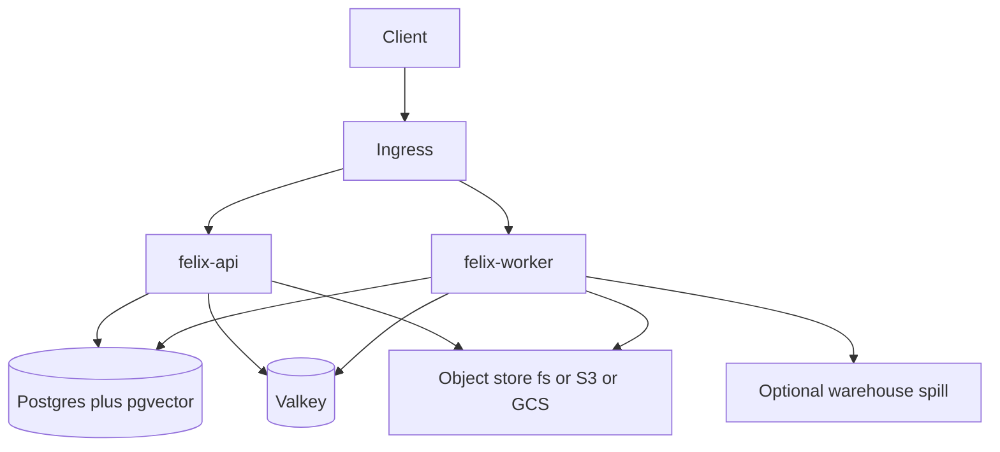

# Manifest secrets, state, and governance

## How Felix works today

### Secret injection (self-hosted)

Secrets are **platform-level**, not manifest-level.

- Backend is `FELIX_SECRETS_BACKEND=env|file|aws|gcp` ([`packages/harness/src/felix/secrets.py`](packages/harness/src/felix/secrets.py)).
- API and worker call `hydrate_secrets()` at startup and fill empty Settings attrs (`anthropic_api_key`, `openai_api_key`, `consumer_shared_secret`, `webhook_secret`) by trying candidate names in the backend.
- `FELIX_SECRET_NAMES` is resolved **only for output redaction**.
- Helm injects the same values as env via a K8s Secret or `secrets.existingSecret` ([`deploy/helm/felix/templates/secret.yaml`](deploy/helm/felix/templates/secret.yaml)).
- After compile, `apply_secret_masking` redacts known secret strings from tool output ([`packages/harness/src/felix/manifests/builder.py`](packages/harness/src/felix/manifests/builder.py)).

Manifests **can still hold plaintext**. `McpServerRef.auth` / `env`, `A2APeerRef.auth`, and `ContainerRef.auth` are raw strings. MCP HTTP puts `auth` on `Authorization`; stdio does `os.environ.copy()` then `env.update(ref.env)` ([`packages/harness/src/felix/mcp/client.py`](packages/harness/src/felix/mcp/client.py), [`stdio.py`](packages/harness/src/felix/mcp/stdio.py)). Nothing rejects a bearer token in Git.

### State persistence (self-hosted)

Postgres is the system of record. Isolation is **application-level `tenant_id` composite PKs**, not Postgres RLS.



| Concern | Where |
|---|---|
| Session transcript | `session_events` + `thread_state` (leaf + labels) |
| Long-term facts | `memory_vectors` (tenant + manifest, capture/consolidate) |
| Durable runs | `fibers.state_json` (`FELIX_DURABILITY=fibers` or Temporal) |
| Manifest GitOps | `manifests` versions + `manifest_active` canary weight |
| Approvals / audit / usage | `approvals`, `audit_events`, `usage_events` |
| OAuth tokens | `oauth_token_cache` (AES-GCM only if `FELIX_OAUTH_CACHE_KEY` is set) |
| Tool artifacts | object store |
| Queues / abort | Valkey, keyed `felix:queue:{tenant}:{binding}` |

Retention is a worker sweep: 30-day audit, 7-day superseded memory ([`packages/harness/src/felix/jobs/retention.py`](packages/harness/src/felix/jobs/retention.py)). Durable fibers stash prompt/result JSON as-is — no secret scrub.

### Governance today (no framework claims)

The repo does **not** mention SOC2, EU AI Act, GDPR, or HIPAA. `FELIX_POLICY_BUNDLE_PUBKEY` is unused.

What *does* exist and is compiled into the agent:

- Tool allowlist, `spec.policies` (scope gates), limits, command/content screening, guardrails/judges, approvals
- SSRF checks on outbound MCP/A2A/container URLs
- Manifest versioning + canary weights
- Audit + optional warehouse spill + anomaly job

What is **declared but not enforced** (confirmed by the [governance explore](d2ef24b4-7fd6-42ef-8d4f-f35f718ce621)):

- `spec.auth.inbound.allow_anonymous` and `required_scopes` appear only on the schema. Bundled manifests set `allow_anonymous: true` and nothing at `/chat`, `/v1`, `/a2a`, or `/mcp` reads those fields. Scope checks happen only if a tool is listed under `spec.policies`.
- Inbound `POST /mcp` binds the raw `ToolProvider` — **no `build_agent` wrappers** (policies, masking, approvals, limits). Chat / OpenAI-compat / A2A `message/send` do compile.
- `audit.store.record_event()` exists but is **not called from the ReAct loop or chat routes** (tests only). SOC2/EU AI Act “logging” would be a paper control until the loop emits.
- `spec.memory.checkpointer` is a schema stub; the real checkpoint is `session_events`.
- Tenant `POST /manifests` can persist plaintext `auth`/`env` into `manifests.manifest_json`.

So the write-up is right about the pattern, and wrong if it implies Felix already vault-refs secrets or maps SOC2 / EU AI Act.

## What we will implement

Stay inside the existing backends (`env|file|aws|gcp`). Do **not** add a new vault product, OPA runtime, or a certification program. Opt-in `spec.governance.frameworks` will **require existing controls** at parse/compile time and close the leak/drift holes.

### 1. Manifest secret refs

Add a small `SecretRef` (string `secret:NAME` or `{secret: NAME}`) and accept it on:

- `McpServerRef.auth` and each `env` value
- `A2APeerRef.auth`, `ContainerRef.auth`

Resolve through `build_secrets(settings)` inside `build_agent` (and stdio spawn). Put resolved values into the masking list. Persist the **ref**, never the value, in `manifest_json`.

Production / `governance.forbid_plaintext_secrets` rejects:

- `auth` that looks like a token (`Bearer …`, long hex/base64)
- `env` values that are not `secret:…` refs

Keep platform hydrate for model API keys — manifests do not need to name `ANTHROPIC_API_KEY`.

### 2. State leak hardening + drift pin

- Reuse `collected_secret_values()` when writing `session_events`, `audit_events.payload_json`, and `fibers.state_json` (same `[REDACTED]` pass as tool output).
- Store `manifest_version` + canonical content hash on `ThreadState.labels_json` and `Fiber.state_json` at run start.
- If `spec.governance.pin_compile: true` (on for `soc2` / `eu_ai_act`), refuse resume / continue when the active manifest hash ≠ the pin. That is the drift control: runtime memory and mid-session model changes cannot silently replace the compiled agent.
- Document that tenant isolation is app-level; operators who need RLS do it in Postgres. No RLS migration in this pass.

### 3. Enforce inbound auth + close the MCP ingress hole

In `build_tenant_agent` / chat + OpenAI-compat + A2A invoke path:

- If `auth.inbound.allow_anonymous` is false and the principal is anonymous → 401
- If `auth.inbound.required_scopes` is set → `require_scopes`

Inbound MCP ([`apps/api/src/felix_api/routes/mcp.py`](apps/api/src/felix_api/routes/mcp.py) → [`mcp/server.py`](packages/harness/src/felix/mcp/server.py)) must resolve a tenant manifest and run tools through the compiled agent (same wrappers as `/chat`). Today it is the protocol-sprawl hole: full builtin tool surface, no policy/masking/approvals.

Leave bundled `quick` / `support` anonymous for local DX. Production examples and `soc2` validation will forbid anonymous.

### 4. Opt-in framework mapping (not certification)

Add to [`schema.py`](packages/harness/src/felix/manifests/schema.py):

```yaml
spec:
  governance:
    frameworks: [soc2, eu_ai_act]   # empty = no extra compile rules
    risk_tier: limited              # limited | high  (EU AI Act deployer hint)
    transparency_notice: true
    forbid_plaintext_secrets: true
    pin_compile: true
    retention_days: 30
```

Compile-time `validate_governance(manifest, settings)` — fail closed, no new policy engine:

**SOC2 (customer evidence, not a Felix cert)** — when `soc2` is listed:

- `auth.inbound.allow_anonymous: false` unless `settings.environment == development`
- `observability.trace: true`, `anomaly.enabled: true`
- `forbid_plaintext_secrets` + `pin_compile`
- at least one of: non-empty `policies`, `approvals`, or `limits`
- inbound schemes or `required_scopes` non-empty

Maps to access control, change management (version + pin), monitoring, confidentiality.

**EU AI Act (deployer duties, not high-risk self-classification)** — when `eu_ai_act` is listed:

- Transparency (Art. 50): `transparency_notice: true` injects a short “you are talking to an AI agent (`metadata.name`)” line into the system prompt and agent card
- Logging / traceability: emit `record_event` from the agent loop (user_input, tool_call, deny, final) into the existing audit store — the table/API already exist
- Human oversight: if `risk_tier: high`, `approvals` must be non-empty and `allow_unattended: false`; `limited` may omit approvals
- Data governance: `content_screening.enabled` or `guardrails` with input target; PII path already in [`content_screening.py`](packages/harness/src/felix/governance/content_screening.py)
- Protocol sprawl: inbound MCP uses the compiled manifest; A2A publish stays off unless declared

`felix doctor` / a `felix validate-manifest` path runs the same validator for GitOps CI. No OPA binary.

### 5. Tests

- SecretRef resolve + reject plaintext in production
- Masking covers MCP-resolved secrets
- Fiber/session write redacts hydrated secrets
- Pin mismatch refuses continue
- Inbound anonymous / missing scope → 401
- Inbound MCP tool call hits compiled wrappers (policy deny / secret mask)
- Agent loop writes an audit row
- `soc2` / `eu_ai_act` fixtures fail closed on missing controls; `quick.yaml` stays valid with empty `frameworks`

## Out of scope

- SOC2 Type II or EU AI Act conformity assessment
- New vault vendors, OPA, or signing `policy_bundle_pubkey`
- Postgres RLS, field-level encryption of all session text
- Changing bundled agents to require JWT
- Wiring Presidio, LLM judges, `command_screening.include_defaults`, or management-API RBAC (real gaps; not this pass)
- Implementing `spec.memory.checkpointer` (session events are the checkpoint)
