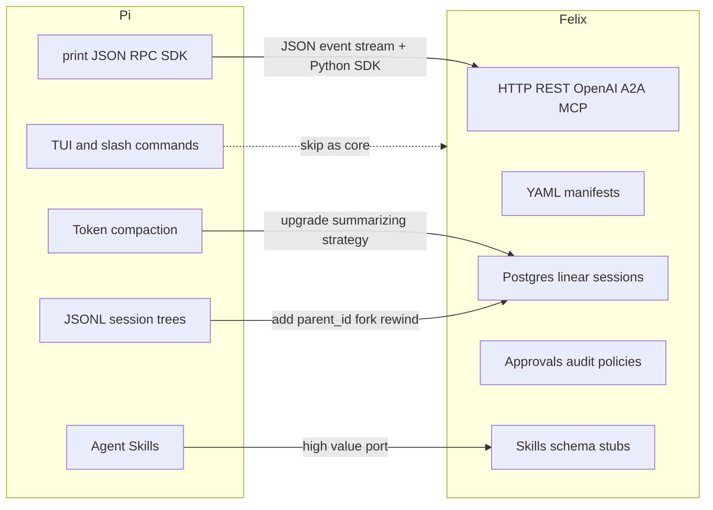

# Pi → Felix feature port audit

[Pi](https://pi.dev/) is a **minimal local coding agent** (TUI + CLI + SDK). Felix is a **self-hosted, manifest-driven agents platform** (HTTP API + worker + Postgres). Copying Pi’s surface would fight Felix’s product. Porting Pi’s *context and session primitives* would fill real Felix gaps — several of which are already declared in schema but not wired.

Sources: [pi.dev](https://pi.dev/), [Pi docs index](https://github.com/earendil-works/pi/blob/main/packages/coding-agent/docs/index.md), [usage](https://github.com/earendil-works/pi/blob/main/packages/coding-agent/docs/usage.md), [skills](https://github.com/earendil-works/pi/blob/main/packages/coding-agent/docs/skills.md), [sessions](https://github.com/earendil-works/pi/blob/main/packages/coding-agent/docs/sessions.md), [compaction](https://github.com/earendil-works/pi/blob/main/packages/coding-agent/docs/compaction.md).

---

## What not to port (skip)

These are either wrong-surface for Felix, or Felix already has a stronger platform version.

- **Interactive TUI, themes, keybindings, fullscreen terminal, `@` file picker, `!command`.** Felix’s surface is HTTP. A TUI would be a separate client, not harness work.
- **Pi’s “we didn’t build it” list as philosophy.** Pi skips MCP, sub-agents, permission popups, plan mode, todos, background bash. Felix already ships MCP *server*, sub-agent patterns (`router` / `parallel` / `groupchat` / `plan_execute`), HITL approvals, and plan tools. Those are Felix’s differentiator.
- **npm/git TypeScript extension packages + `pi install`.** Felix already has a Python plugin seam in [`packages/harness/src/felix/plugins.py`](packages/harness/src/felix/plugins.py). A JS package gallery would be a second ecosystem.
- **Self-edit + `/reload`.** Pi customizes itself on disk. Felix is a deployed multi-tenant service; manifests + canary/rollback already cover “change the agent without forking the runtime.”
- **Gist `/share`, llama.cpp `/llama`, OAuth `/login` in a TUI.** Share/export can exist later as HTTP; provider auth belongs in env/secrets, which Felix already has.
- **Default coding tools (`read`/`write`/`edit`/`bash`).** Useful for a coding-agent *manifest*, not as Felix core builtins (today: calculator + skill stubs in [`packages/harness/src/felix/tools/builtins.py`](packages/harness/src/felix/tools/builtins.py)). Wire via sandbox/container refs already in schema.

---

## Feature matrix

**Verdicts:** Port (take the idea into Felix), Adapt (same idea, Felix-shaped), Skip, Already have.

- **Agent Skills (SKILL.md, progressive disclosure)** — **Port.** Pi implements [agentskills.io](https://agentskills.io/specification): scan locations, put name+description in the system prompt, load full `SKILL.md` on demand (via `read` or `/skill:name`). Felix already declares `spec.skills: list[SkillRef]` in [`schema.py`](packages/harness/src/felix/manifests/schema.py) and exposes `list_skills` / `activate_skill` / `deactivate_skill`, but those handlers are stubs (`return "[]"`). Closest, highest-leverage port. Wire discovery from object store / bundled dirs, inject skill catalog into the system prompt, and make `activate_skill` append the SKILL.md body for the turn (and persist in `SkillActivation` / `active_skills`).
- **AGENTS.md / CLAUDE.md / SYSTEM.md layered context files** — **Adapt.** Pi loads `AGENTS.md` from `~/.pi/agent/`, parents, and cwd; `SYSTEM.md` replaces the default prompt; `APPEND_SYSTEM.md` appends. Felix composes prompts from manifest `SystemPrompt.inline` / `base` / `soul` only. For coding-oriented manifests, add an optional `system_prompt.files` (or workspace-root AGENTS.md fetch from object store / mounted workspace) and layer it under the manifest prompt. Do not glob the API server’s filesystem as Pi does.
- **Token-threshold compaction + structured summaries** — **Port (upgrade).** Pi auto-compacts when `contextTokens > contextWindow - reserveTokens`, keeps a recent token window, writes a `CompactionEntry` with `firstKeptEntryId`, and uses a Goal/Progress/Decisions summary plus cumulative file tracking. Felix’s `SummarizingSessionStrategy` in [`session/strategies.py`](packages/harness/src/felix/session/strategies.py) is turn-count based (`summarizing:N`), not token-based, and has no structured summary format or compaction event kind. Extend `SessionEventKind` with `compaction`, add token budgets to `SessionSpec`, and compact on overflow the way Pi does.
- **Tree sessions, rewind, fork, clone, bookmarks** — **Adapt.** Pi stores JSONL trees (`id` + `parentId`), `/tree` jumps the leaf, `/fork`/`/clone` create new files, labels are bookmarks, abandoned branches can be summarized. Felix sessions are a linear `seq` log (`SessionEventRow` PK is `tenant_id, thread_id, seq`) with no `parent_id`. Add optional `event_id` + `parent_id` + `leaf_id` on the thread; keep linear seq for audit. Expose `POST /threads/{id}/fork` and `rewind_to` on chat. Branch summarization is only worth it after trees exist.
- **Steer vs follow-up while the agent runs** — **Adapt.** Pi: Enter = steer (after current tools, cancel remaining); Alt+Enter = follow-up (wait until idle). Felix chat is one request → one invoke; SSE in [`routes/chat.py`](apps/api/src/felix_api/routes/chat.py) has no inbound queue. For `/chat/stream`, accept a second POST (or SSE comment channel) that enqueues `steer` (interrupt remaining tools after current) vs `follow_up` (append after `final`). Maps cleanly onto existing `analyze_wake()` pending-tool-call state.
- **Four modes: interactive / print / JSON / RPC / SDK** — **Adapt, not copy.** Felix already has the “print” equivalent (HTTP + OpenAI + A2A + MCP). Missing: a **JSON event stream** on SSE (tool_start, text_delta, compact, approval_needed) and a **Python SDK** wrapping `createAgentSession`-like APIs (`prompt`, `steer`, `followUp`, `compact`, `setModel`). Skip stdin JSONL RPC; HTTP is the right transport.
- **Mid-session model switch (`/model`)** — **Adapt.** Pi switches models on the same session tree. Felix binds model at manifest compile time in [`builder.py`](packages/harness/src/felix/manifests/builder.py). Add request-level `model` override on `/chat` (allowlisted against manifest `fallbacks` + tenant routes) and persist a `model_change` session event so replay uses the new client.
- **Prompt templates (`/name`, `$1`, `$@`)** — **Adapt as named prompts.** Pi markdown files expand as slash commands. Felix: `spec.prompts[]` or tenant-scoped prompt store, invoked as `POST /chat` with `prompt: review` + args. Lower priority than skills; skills cover most of this.
- **Dynamic context via extension hooks** — **Adapt onto plugins.** Pi extensions inject/filter messages each turn and customize compaction (`session_before_compact`). Felix plugins today register routes/tools/auth/cron only. Add agent-loop hooks: `before_turn`, `filter_history`, `before_compact`. This is how RAG / long-term memory should land instead of more schema-only fields.
- **15+ providers, OAuth, models.json** — **Low priority.** Felix has Anthropic/OpenAI/Ollama + LiteLLM proxy + fallbacks + confidence escalation. Expanding providers via LiteLLM is enough; don’t rebuild Pi’s provider catalog.
- **Session HTML export / import** — **Nice-to-have.** Useful for eval and support. Felix already has audit + warehouse export. A `GET /threads/{id}/export` (JSONL or HTML) is cheap once trees exist.
- **Project trust** — **Skip as a feature; already covered.** Pi prompts before loading project `.pi/` code. Felix’s equivalent is tenant auth, command screening, approvals, and sandbox executors.

---

## Recommended port order (if we implement)

Do these in harness/API — not a TUI. Each step is independently useful.

1. **Real skills (Agent Skills spec)** — replace stubs in [`builtins.py`](packages/harness/src/felix/tools/builtins.py); load from `spec.skills` + object-store skill dirs; progressive disclosure in the system prompt. Touch [`schema.py`](packages/harness/src/felix/manifests/schema.py) `SkillRef`, [`builder.py`](packages/harness/src/felix/manifests/builder.py), `SkillActivation` in [`db/models.py`](packages/harness/src/felix/db/models.py).
2. **Token compaction** — upgrade `SummarizingSessionStrategy`; add `compaction` events; `SessionSpec` gains `reserve_tokens` / `keep_recent_tokens` / `enabled`.
3. **Steer / follow-up on `/chat/stream`** — inbound queue + interrupt remaining tools; reuse wake analysis.
4. **Session fork / rewind** — `parent_id` + leaf pointer; `POST /threads/{id}/fork`.
5. **SSE JSON event stream + thin Python client** — Pi’s JSON/SDK modes, HTTP-shaped.
6. **AGENTS.md layering for workspace-backed agents** — optional, behind a manifest flag.
7. **Plugin `before_turn` / `before_compact` hooks** — unlock custom compaction and memory without core bloat.
8. **Request-level model override** — persist as a session event.

---

## Felix gaps Pi does not solve (do not confuse with this audit)

Schema-only and still unwired, independent of Pi: MCP *client* (`spec.mcp_servers`), A2A peers, containers/queues/browser tools, artifacts, procedural memory, `memory.capture`, real model streaming (currently fake in `_HttpModelClient.stream`). Those are Felix roadmap items, not Pi ports.
